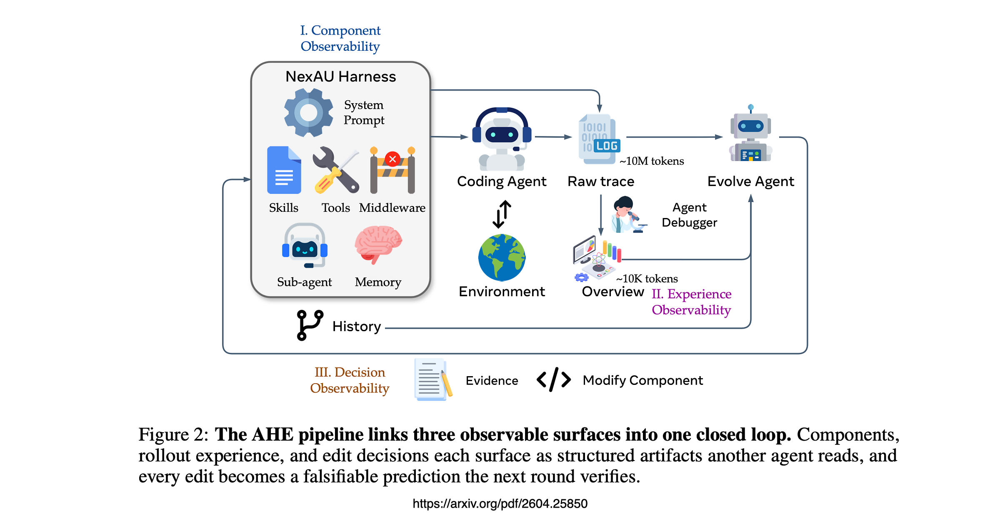

# Auto Agentic Harness Engineering

## The Agent Harness Is Where Coding-Agent Gains Actually Live

*A new paper proposes letting an agent rewrite its own scaffolding round after round…*

---

## TLDR

The model is rented. The harness is owned.

Structural components like tools, middleware, memory — all are the durable IP.

The agent is reasonably good at predicting what its edits will fix. It is genuinely bad at predicting what they will break.

Stop treating the system prompt as your primary optimisation surface. It is the least portable part of the harness, and the part that regresses on its own.

Build the rollback machinery on the assumption that some fraction of every round's edits are silent regressions.

The harness is a portable artefact. It travels across providers. The model is rented. The harness is owned.

---

## In Short

**The prompt is the noisiest layer.** When the evolved system prompt was swapped into the seed harness on its own, performance regressed. Tools, middleware, and memory each lifted it.

**Falsifiable edits beat rationale loops.** Every harness change ships with a written prediction of which tasks it will fix and which it might regress…verified against the next rollout, rolled back if wrong.

**Agents have an optimism asymmetry.** Fix-precision was 33.7%. Regression-precision was 11.8%. Forward justification is cheap. Defensive prediction is expensive.

**The harness travels.** Frozen and re-run on three other model families and a different benchmark, the evolved harness held its gains, biggest lift on the weakest base.

**The model is rented.** Models get deprecated, newer models are introduced. Alliances with tech providers shift.

The harness is owned. Structural components like tools, middleware, memory, all are the durable IP.

---

## The Setup

The paper is *Agentic Harness Engineering: Observability-Driven Automatic Evolution of Coding-Agent Harnesses*.

The premise is slightly heretical…coding-agent performance is now bottlenecked by the harness as much as by the model, and harness design is still a manual craft.

The authors argue the bottleneck for automating that loop is not evolve-agent capability. It is observability.

Ten iterations. Pass 1 on Terminal-Bench 2 lifts from 69.7% to 77.0%, beating Codex-CLI's hand-crafted harness at 71.9% and the two automated baselines by 4–8 points. Roughly 32 hours of compute.

That is the headline. It is not what kept me thinking about this paper.

---

## The Finding That Should Reshape How We Talk About Prompt Engineering

The authors took the fully evolved harness and asked this question…

What happens if we swap one evolved component into the seed harness?

The evolved system prompt regressed on its own. It only earns its keep when the surrounding tools, middleware and memory are present to make its instructions executable.

The paper's framing is clean…factual harness structure transfers; prose-level strategy does not.

Tools that auto-surface contract hints. Middleware that runs an evaluator-isomorphic closure check. Memory that encodes 12 specific boundary cases. These are durable.

A 79-line prompt that says "be careful" is not.

---

## Falsifiable Edits

Every edit the evolve agent makes ships with a self-declared prediction…which tasks this edit will fix, and which tasks it might regress.

The next round runs, the loop intersects the prediction with observed task-level deltas. Wins are kept. Losses are rolled back at file granularity.

Every harness edit becomes a falsifiable contract between rounds. Not a rationale. A measurable claim that either holds up or doesn't.

Most self-improving agent loops today are just rationale loops. AHE forces the prediction to be specific before the next evaluation runs, so the agent cannot quietly retcon what an edit was supposed to do.

---

## The Limit Of Self-Improving Agents

The honest limit shows up in the self-attribution analysis. Across nine rounds, the evolve agent's predictions had fix precision of 33.7% and regression precision of 11.8%.

The agent is reasonably good at predicting what its edits will fix. It is genuinely bad at predicting what they will break.

This is the load-bearing finding. Agents have an optimism asymmetry.

They can argue forward, here is why this should help. They cannot argue defensively, here is what this might quietly break.

Same blind spot we see in code review with LLMs, in self-critique loops, in reflection prompts. Until we have an evolve agent that can argue against its own edit, self-improvement loops will keep paying the regression tax.

---

## If You Are Building AI Agents

Stop treating the system prompt as your primary optimisation surface. It is the least portable part of the harness, and the part that regresses on its own.

Adopt the falsifiable-contract pattern even without a full evolution loop. Every harness change should answer in writing, which failures do we expect this to fix, and which behaviours might it regress?

Verify against rollouts. This costs almost nothing and turns your change-log into a real ledger.

Assume regression blindness in any self-evolving system. Build the rollback machinery on the assumption that some fraction of every round's edits are silent regressions.

The harness is a portable artefact. It travels across providers. The model is rented. The harness is owned.

---

## Lastly

This lands cleanly on top of the framing Anthropic has been pushing in *Building Effective Agents*. A general-purpose agent harness with rich tools and a simple loop, rather than a per-task scaffold tuned to a specific model. AHE turns that thesis into measurable claims.

The piece I will keep coming back to is the prompt regression. One number in one ablation table. But it points at a habit our field has not yet broken, we treat prompts as the lever because they are the easiest thing to edit and the most visible thing to show, not because they are where the gains live.

If the next year of agent work is a contest between prettier prompts and more durable harnesses, I know which side I am betting on.

---

Chief AI Evangelist @ Kore.ai | I'm passionate about exploring the intersection of AI and language. From Language Models, AI Agents to Agentic Applications, Development Frameworks & Data-Centric Productivity Tools, I share insights and ideas on how these technologies are shaping the future.

*Agentic Harness Engineering: Observability-Driven Automatic Evolution of Coding-Agent Harnesses* — harnesses are now central to coding-agent performance, mediating how models interact with tools and execution. <https://arxiv.org/pdf/2604.25850>

COBUS GREYLING — Where AI Meets Language | Language Models, AI Agents, Agentic Applications, Development Frameworks & Data-Centric — <https://www.cobusgreyling.com>
